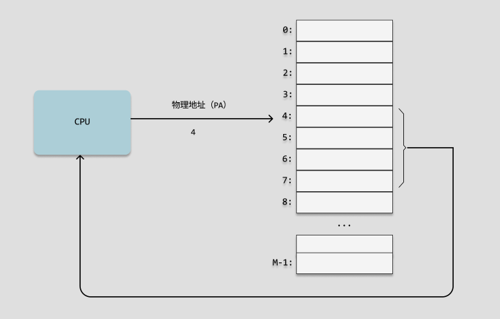

### 内存管理

虚拟内存是硬件异常、硬件地址翻译、主存、磁盘文件和内核软件的完美交互，它为每个进程提供了一个大的、一致的和私有的地址空间。虚拟内存提供了三个重要的功能：

+ 它将主存看成是一个存储在磁盘上的地址空间的高速缓存。在主存中只保存活动区域，并根据需要在磁盘和主存之间来回传送数据，通过这种方式，它高效地使用了主存。
+ 它为每个进程提供了一致的地址空间，从而简化了内存管理。
+ 它保护了每个进程的地址空间不被其他进程破坏。
#### 物理地址

计算机的主存被组织成一个由 `M` 个连续的字节大小的单元组成的数组。每个字节都有一个唯一的 `物理地址(Physical Address，PA)`。第一字节的地址为 `0` ，接下来的字节地址为 `1` ，以此类推。

`CPU`访问内存的最自然的方式就是使用物理地址。把这种方式称为 `物理寻址(physical addressing)`。

