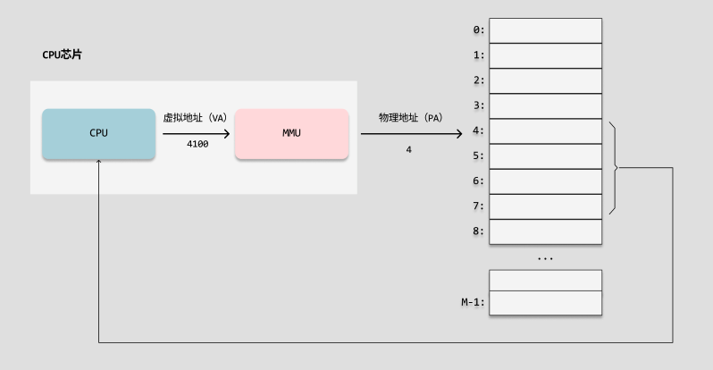

## 内存管理

虚拟内存是硬件异常、硬件地址翻译、主存、磁盘文件和内核软件的完美交互，它为每个进程提供了一个大的、一致的和私有的地址空间。虚拟内存提供了三个重要的功能：

+ 它将主存看成是一个存储在磁盘上的地址空间的高速缓存。在主存中只保存活动区域，并根据需要在磁盘和主存之间来回传送数据，通过这种方式，它高效地使用了主存。
+ 它为每个进程提供了一致的地址空间，从而简化了内存管理。
+ 它保护了每个进程的地址空间不被其他进程破坏。

### 物理地址

计算机的主存被组织成一个由 `M` 个连续的字节大小的单元组成的数组。每个字节都有一个唯一的 `物理地址(Physical Address，PA)`。第一字节的地址为 `0` ，接下来的字节地址为 `1` ，以此类推。

`CPU`访问内存的最自然的方式就是使用物理地址。把这种方式称为 `物理寻址(physical addressing)`。


早期的PC使用物理寻址，而且单片机的CPU也是继续使用这种寻址方式。

在这种情况下，要想在内存中同时运行两个程序是不可能的。如果第一个程序在 `2000` 的位置写入一个新的值，将会擦掉第二个程序存放在相同位置上的所有内容，所以同时运行两个程序是根本行不通的，这两个程序会立刻崩溃。

    操作系统是如何解决多个进程物理内存覆盖的问题呢？

### 地址空间

`地址空间(address space)`是一个非负整数地址的有序集合。如果地址空间中的整数是连续的，那么说它是一个线性地址空间(`linear address space`)。

在一个带虚拟内存的系统中，CPU从一个有 $ N = 2^{n} $ 个地址的地址空间中生产虚拟地址，这个虚拟地址称为`虚拟地址空间(virtual address space)` :
```math
{0, 1, 2, 3, ... , N-1}
```

一个地址空间的大小是由表示最大地址所需要的位数来描述的。现代系统通常支持`32`位或者`64`位虚拟地址空间。

一个系统还有一个`物理地址空间(physical address space)`，对应于系统中物理内存的`M`个字节：
```math
{0, 1, 2, ..., M - 1}
```

### 物理内存的覆盖

可以把进程所使用的地址「隔离」开来，即让操作系统为每个进程分配独立的一套「`虚拟地址`」，人人都有，大家自己玩自己的地址就行，互不干涉。但是有个前提每个进程都不能访问物理地址，至于虚拟地址最终怎么落到物理内存里，对进程来说是透明的，操作系统已经把这些都安排的明明白白了。


操作系统会提供一种机制，将不同进程的虚拟地址和不同内存的物理地址映射起来。

如果程序要访问虚拟地址的时候，由操作系统转换成不同的物理地址，这样不同的进程运行的时候，写入的是不同的物理地址，这样就不会冲突了


