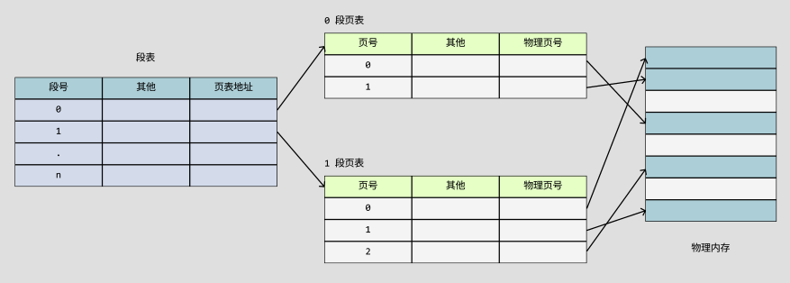

## 内存管理

虚拟内存是硬件异常、硬件地址翻译、主存、磁盘文件和内核软件的完美交互，它为每个进程提供了一个大的、一致的和私有的地址空间。虚拟内存提供了三个重要的功能：

+ 它将主存看成是一个存储在磁盘上的地址空间的高速缓存。在主存中只保存活动区域，并根据需要在磁盘和主存之间来回传送数据，通过这种方式，它高效地使用了主存。
+ 它为每个进程提供了一致的地址空间，从而简化了内存管理。
+ 它保护了每个进程的地址空间不被其他进程破坏。

### 物理地址

计算机的主存被组织成一个由 `M` 个连续的字节大小的单元组成的数组。每个字节都有一个唯一的 `物理地址(Physical Address，PA)`。第一字节的地址为 `0` ，接下来的字节地址为 `1` ，以此类推。

`CPU`访问内存的最自然的方式就是使用物理地址。把这种方式称为 `物理寻址(physical addressing)`。


早期的PC使用物理寻址，而且单片机的CPU也是继续使用这种寻址方式。

在这种情况下，要想在内存中同时运行两个程序是不可能的。如果第一个程序在 `2000` 的位置写入一个新的值，将会擦掉第二个程序存放在相同位置上的所有内容，所以同时运行两个程序是根本行不通的，这两个程序会立刻崩溃。

    操作系统是如何解决多个进程物理内存覆盖的问题呢？

### 地址空间

`地址空间(address space)`是一个非负整数地址的有序集合。如果地址空间中的整数是连续的，那么说它是一个线性地址空间(`linear address space`)。

在一个带虚拟内存的系统中，CPU从一个有 $ N = 2^{n} $ 个地址的地址空间中生产虚拟地址，这个虚拟地址称为`虚拟地址空间(virtual address space)` :
```math
{0, 1, 2, 3, ... , N-1}
```

一个地址空间的大小是由表示最大地址所需要的位数来描述的。现代系统通常支持`32`位或者`64`位虚拟地址空间。

一个系统还有一个`物理地址空间(physical address space)`，对应于系统中物理内存的`M`个字节：
```math
{0, 1, 2, ..., M - 1}
```

### 物理内存的覆盖

可以把进程所使用的地址「隔离」开来，即让操作系统为每个进程分配独立的一套「`虚拟地址`」，人人都有，大家自己玩自己的地址就行，互不干涉。但是有个前提每个进程都不能访问物理地址，至于虚拟地址最终怎么落到物理内存里，对进程来说是透明的，操作系统已经把这些都安排的明明白白了。


操作系统会提供一种机制，将不同进程的虚拟地址和不同内存的物理地址映射起来。

+ 程序所使用的内存地址叫做虚拟内存地址（Virtual Memory Address）
+ 实际存在硬件里面的空间地址叫物理内存地址（Physical Memory Address）。


如果程序要访问虚拟地址的时候，由操作系统转换成不同的物理地址，这样不同的进程运行的时候，写入的是不同的物理地址，这样就不会冲突了


### 虚拟地址和物理地址的管理

操作系统管理虚拟地址和物理地址，分别是 **`内存分段`** 和 **`内存分页`** 。

#### 内存分段

程序是由若干个逻辑分段组成的，如可由代码分段、数据分段、栈段、堆段组成。不同的段是有不同的属性的，所以就用`分段（Segmentation）`的形式把这些段分离出来。

分段机制下的虚拟地址由两部分组成，段选择因子和段内偏移量。


段选择因子和段内偏移量：
+ 段选择因子就保存在段寄存器里面。段选择子里面最重要的是`段号`，用作段表的索引。段表里面保存的是这个`段的基地址`、`段的界限`和`特权等级`等。
+ 虚拟地址中的`段内偏移量`应该位于 0 和段界限之间，如果段内偏移量是合法的，就将段基地址加上段内偏移量得到物理内存地址。

虚拟地址是通过段表与物理地址进行映射的。每个段在段表中有一个项，在这一项找到段的基地址，再加上偏移量，于是就能找到物理内存中的地址。


上面例子中，要访问段 3 中偏移量 500 的虚拟地址，我们可以计算出物理地址为，段 3 基地址 7000 + 偏移量 500 = 7500。


**内存分段的不足之处**：
+ 内存碎片的问题
+ 内存交换的效率低的问题

内存碎片主要分为，`内部内存碎片`和`外部内存碎片`。

内存分段管理可以做到段根据实际需求分配内存，所以有多少需求就分配多大的段，所以不会出现内部内存碎片。

但是由于每个段的长度不固定，所以多个段未必能恰好使用所有的内存空间，会产生了多个不连续的小物理内存，导致新的程序无法被装载，所以会出现外部内存碎片的问题。


解决「外部内存碎片」的问题就是内存交换。

可以把音乐程序占用的那 256MB 内存写到硬盘上，然后再从硬盘上读回来到内存里。不过再读回的时候，我们不能装载回原来的位置，而是紧紧跟着那已经被占用了的 512MB 内存后面。这样就能空缺出连续的 256MB 空间，于是新的 200MB 程序就可以装载进来。

这个内存交换空间，在 Linux 系统里，也就是我们常看到的` Swap 空间`，这块空间是从硬盘划分出来的，用于内存与硬盘的空间交换。

对于多进程的系统来说，用分段的方式，外部内存碎片是很容易产生的，产生了外部内存碎片，那不得不重新 Swap 内存区域，这个过程会产生性能瓶颈。

因为硬盘的访问速度要比内存慢太多了，每一次内存交换，我们都需要把一大段连续的内存数据写到硬盘上。

所以，如果内存交换的时候，交换的是一个占内存空间很大的程序，这样整个机器都会显得卡顿。

为了解决内存分段的「外部内存碎片和内存交换效率低」的问题，就出现了内存分页。


#### 内存分页

分段的好处就是能产生连续的内存空间，但是会出现「外部内存碎片和内存交换的空间太大」的问题。

要解决这些问题，那么就要想出能少出现一些内存碎片的办法。另外，当需要进行内存交换的时候，让需要交换写入或者从磁盘装载的数据更少一点，这样就可以解决问题了。这个办法，也就是`内存分页（Paging）`。

分页是把整个虚拟和物理内存空间切成一段段固定尺寸的大小。这样一个连续并且尺寸固定的内存空间，我们叫`页（Page）`。在 Linux 下，每一页的大小为 `4KB`。


页表是存储在内存里的，`内存管理单元 （MMU）`就做将虚拟内存地址转换成物理地址的工作。

而当进程访问的虚拟地址在页表中查不到时，系统会产生一个`缺页异常`，进入系统内核空间分配物理内存、更新进程页表，最后再返回用户空间，恢复进程的运行。


采用了分页，页与页之间是紧密排列的，所以不会有外部碎片。

但是，因为内存分页机制分配内存的最小单位是一页，即使程序不足一页大小，我们最少只能分配一个页，所以页内会出现内存浪费，所以针对内存分页机制会有内部内存碎片的现象。


如果内存空间不够，操作系统会把其他正在运行的进程中的「最近没被使用」的内存页面给释放掉，也就是暂时写在硬盘上，称为`换出（Swap Out）`。一旦需要的时候，再加载进来，称为`换入（Swap In）`。所以，一次性写入磁盘的也只有少数的一个页或者几个页，不会花太多时间，内存交换的效率就相对比较高。


分页的方式使得我们在加载程序的时候，不再需要一次性都把程序加载到物理内存中。我们完全可以在进行虚拟内存和物理内存的页之间的映射之后，并不真的把页加载到物理内存里，而是只有在程序运行中，需要用到对应虚拟内存页里面的指令和数据时，再加载到物理内存里面去。


在分页机制下，虚拟地址分为两部分，`页号`和`页内偏移`。页号作为页表的索引，页表包含物理页每页所在物理内存的基地址，这个基地址与页内偏移的组合就形成了物理内存地址。


对于一个内存地址转换，其实就是这样三个步骤：

+ 把虚拟内存地址，切分成页号和偏移量；
+ 根据页号，从页表里面，查询对应的物理页号；
+ 直接拿物理页号，加上前面的偏移量，就得到了物理内存地址。

这种简单的分页在空间上存在缺陷。

在 32 位的环境下，虚拟地址空间共有 4GB，假设一个页的大小是 `4KB（2^12）`，那么就需要大约 100 万 （2^20） 个页，每个「页表项」需要 4 个字节大小来存储，那么整个 4GB 空间的映射就需要有 `4MB` 的内存来存储页表。

这 4MB 大小的页表，看起来也不是很大。但是要知道每个进程都是有自己的虚拟地址空间的，也就说都有自己的页表。

那么，100 个进程的话，就需要 400MB 的内存来存储页表，这是非常大的内存了，更别说 64 位的环境了。


#### 多级页表

要解决上面的问题，就需要采用一种叫作`多级页表（Multi-Level Page Table）`的解决方案。

对于单页表的实现方式，在 32 位和页大小 4KB 的环境下，一个进程的页表需要装下 100 多万个「页表项」，并且每个页表项是占用 4 字节大小的，于是相当于每个页表需占用 4MB 大小的空间。


将页表（一级页表）分为 1024 个页表（二级页表），每个表（二级页表）中包含 1024 个「页表项」，形成二级分页。


将页表（一级页表）分为 1024 个页表项（二级页表），每个表（二级页表）中包含 1024 个「页表项」，形成二级分页。


如果 4GB 的虚拟地址全部都映射到了物理内存上的话，二级分页占用空间确实是更大了，但是，往往不会为一个进程分配那么多内存。

如果使用了二级分页，一级页表就可以覆盖整个 4GB 虚拟地址空间，但如果某个一级页表的页表项没有被用到，也就不需要创建这个页表项对应的二级页表了，即可以在需要时才创建二级页表。

假设只有 20% 的一级页表项被用到了，那么页表占用的内存空间就只有 4KB（一级页表） + 20% * 4MB（二级页表）= 0.804MB，这对比单级页表的 4MB 是不是一个巨大的节约？

从页表的性质来看，保存在内存中的页表承担的职责是将虚拟地址翻译成物理地址。假如虚拟地址在页表中找不到对应的页表项，计算机系统就不能工作了。所以页表一定要覆盖全部虚拟地址空间，不分级的页表就需要有 100 多万个页表项来映射，而二级分页则只需要 1024 个页表项（此时一级页表覆盖到了全部虚拟地址空间，二级页表在需要时创建）。

把二级分页再推广到多级页表，就会发现页表占用的内存空间更少了，这一切都要归功于对局部性原理的充分应用。

对于 64 位的系统，两级分页肯定不够了，就变成了四级目录，分别是：
+ 全局页目录项 PGD（Page Global Directory）；
+ 上层页目录项 PUD（Page Upper Directory）；
+ 中间页目录项 PMD（Page Middle Directory）；
+ 页表项 PTE（Page Table Entry）；


#### TLB

多级页表虽然解决了空间上的问题，但是虚拟地址到物理地址的转换就多了几道转换的工序，这显然就降低了这俩地址转换的速度，也就是带来了时间上的开销。

程序是有局部性的，即在一段时间内，整个程序的执行仅限于程序中的某一部分。相应地，执行所访问的存储空间也局限于某个内存区域。

可以利用这一特性，把最常访问的几个页表项存储到访问速度更快的硬件。在 CPU 芯片中，加入了一个专门存放程序最常访问的页表项的 Cache，这个 Cache 就是 `TLB（Translation Lookaside Buffer）` ，通常称为页表缓存、转址旁路缓存、快表等。


在 CPU 芯片里面，封装了内存管理单元（Memory Management Unit）芯片，它用来完成地址转换和 TLB 的访问与交互。

有了 TLB 后，那么 CPU 在寻址时，会先查 TLB，如果没找到，才会继续查常规的页表。


### 段页式内存管理

内存分段和内存分页并不是对立的，它们是可以组合起来在同一个系统中使用的，那么组合起来后，通常称为段页式内存管理。

段页式内存管理实现的方式：
+ 先将程序划分为多个有逻辑意义的段，也就是前面提到的分段机制；
+ 接着再把每个段划分为多个页，也就是对分段划分出来的连续空间，再划分固定大小的页；


这样，地址结构就由`段号`、`段内页号`和`页内位移`三部分组成。

用于段页式地址变换的数据结构是每一个程序一张段表，每个段又建立一张页表，段表中的地址是页表的起始地址，而页表中的地址则为某页的物理页号



段页式地址变换中要得到物理地址须经过三次内存访问：
+ 第一次访问段表，得到页表起始地址；
+ 第二次访问页表，得到物理页号；
+ 第三次将物理页号与页内位移组合，得到物理地址。

可用软、硬件相结合的方法实现段页式地址变换，这样虽然增加了硬件成本和系统开销，但提高了内存的利用率。


### Linux 内存管理

早期 Intel 的处理器从 80286 开始使用的是段式内存管理。

在不久以后的 80386 中就实现了页式内存管理。也就是说，80386 除了完成并完善从 80286 开始的段式内存管理的同时还实现了页式内存管理。

80386 的页式内存管理的作用是在由段式内存管理所映射而成的地址上再加上一层地址映射。

由于此时由段式内存管理映射而成的地址不再是“物理地址”了，Intel 就称之为“线性地址”（也称虚拟地址）。于是，段式内存管理先将逻辑地址映射成线性地址，然后再由页式内存管理将线性地址映射成物理地址。


+ 程序所使用的地址，通常是没被段式内存管理映射的地址，称为逻辑地址；
+ 通过段式内存管理映射的地址，称为线性地址，也叫虚拟地址；


